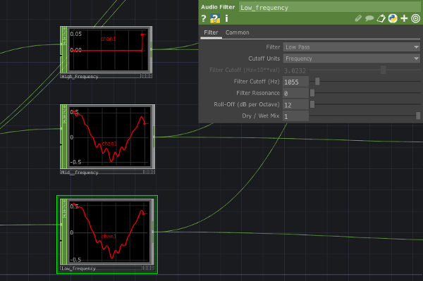

# visualsTemplateTouchDesignerOF

This app reads in openFrameworks messages sent from TouchDesigner through the OSC protocol.

The openFrameworks app reads the high, the mid and the low frequencies values and use them to draw on the screen.

The TouchDesigner app play the audio file, makes the audio analysis and sends the OSC messages.

## Tuning

Each audio piece has its own structure, highliting some frequencies works good on my example file, but could not work on yours. Therefore, it is reccomended to tune your frequencies in the TouchDesigner application. Follow this steps to set up you sound analysis:

- Select the AudioFileIn node on the left side, press 'p' and select the audio file you want to analyze. To play listen this audio file, select the 'audiodevout1' node on the top-left corner and toggle 'Active' from Off to On.

- The TouchDesigner application sends 3 values through OSC, the high, the low and the mid frequencies. To tune one of this value, select one of these 3  nodes, for example the Low_frequency one, and press 'p' to open the dialog window on the right side. 

- From the dropdown menu, select the filter that you would like to apply, then choose the 'Filter Cutoff' value. To have a better feeling of the frequencies that you are selecting, turn off the 'audiodevice1' node, turn on the 'audiodevice2' node, select the switch node and change the index until you selec the index of the frequency that you are editing at the moment. Look at the audiospectrum and listen to the sound while changing the cutoff value, this will give you a better idea of the frequency that you are picking.

## Notes on the TouchDesigner app
These notes are from a beginner, take it as they are.

- There are 3 ways to select bands from an audioFileIn node. You can attach an `Audio Filter` node, a `Audio Band EQ` or a `Audio Para EQ`. I have choose the `Audio Filter` node because it was the easiest one, but you can works also with the other two.
- After you pick one of this 3 nodes, the pipeline is:
1) A resample node to have 60 values per sec
2) a math node to make all the values positive, so that we do not need to handle negative values in OF
3) a filter node with a `filter width` of 0.2, to smooth the signal a bit.
4) a merge node to merge all the 3 values into one message
5) an OSC node to send them out

## Credits.

The Touch designer pipeline comes from [this](https://www.youtube.com/watch?v=K7fRKMCBnd0) tutorial by Matthew Ragan.

It is basically,

The openFrameworks app is just a simple variation over the `example/communication/oscReceiveExample`
